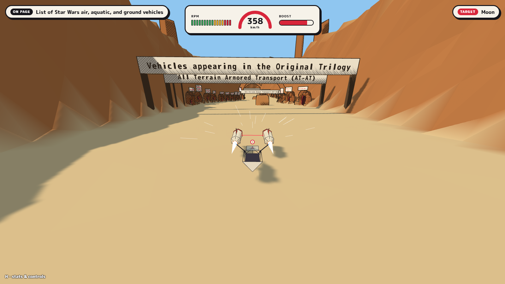
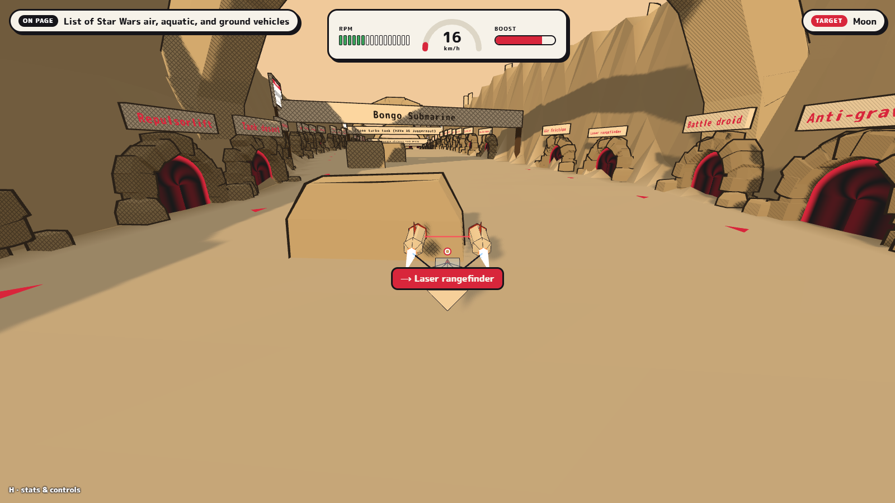

# Isle of Wiki

**Wikipedia pod racing in folded-paper canyons.** Every Wikipedia article becomes a race
track: its sections are canyons, its links are caves in the canyon walls, and driving through
a cave takes you to the page it links to. Race from a start article to a target article, with
no search box, only the links. Inspired by *Star Wars Episode I: Racer* and the Wikipedia game.



## How a page becomes a track

- **The Seedpod** is the arena you arrive in. The article's infobox links are cave gates in
  its grandstand.
- **Each section is a canyon**, and the section's text runs along it as banners and gateways.
- **Each link is a cave**, in reading order, with its target's name on a plaque above the mouth.
  Pull up in front of one and press **J** to travel through it.
- **Images and billboards** stand trackside.
- **The engine picks the world** for each page: a *structure* (how the canyons are arranged:
  The Hidden Lotus, Vine or Lilypad) and a *biome* (Dune, Frost, Canopy, Ember or Relic). The
  first racer to reach a page decides its world for everyone in the room.



Worlds are fully deterministic. The same article gives every player (and, later, the server)
exactly the same track, down to every rock.

## Play

```sh
npm install
npm run dev        # then open http://localhost:5173
```

Pick a start page and a target page and start the race. Click the world to take control: the
countdown runs 3, 2, 1, GO and the clock starts. Every cave you drive through takes you down a
**link tunnel** to the page it links to. Reach the target page and the clock stops; the finish
card shows your time, your hops and the path you took, and remembers your best time for that
pair of pages.

Each trip through a tunnel costs exactly 2 seconds on the clock, however long the next page takes
to download and build, so a slow connection never loses you the race.

| Key | Action |
|---|---|
| **W / S** | Throttle / brake, then reverse |
| **A / D** | Steer: tight when slow, wider at speed, like a car |
| **Space** | Brake |
| **Shift** | Boost (the tank refills; run it dry and it locks out for a moment) |
| **Mouse** | Orbit the chase camera (it swings back behind you on its own) |
| **J** | Travel through the cave in front of you |
| **WASD** in a tunnel | Drift the pod around the tube |
| **Tab** | **Folio**: the article as text plus a zoomable map of the track; pick a link to set a **Thread** |
| **R** | Respawn at the last safe spot |
| **H** | Stats and controls |
| **Esc** | Release the mouse |

A gamepad works too: left stick steers, the triggers are throttle and brake, RB is boost and B
brakes.

Debug keys: **F** free-fly camera, **G** GNME roll call, **P** physics collider view,
**B** (with P) drop test balls.

## Develop

```sh
npm test           # 137 tests: parser, layouts, physics, pod handling, race rules, auto-driver on every track
npm run typecheck
npm run build
```

The tests include an auto-driver that drives every canyon of every structure end to end, and
checks that every cave can be reached and every bridge crossed.

### Project layout

| Path | What lives there |
|---|---|
| `packages/shared` | Runs in the browser **and** (later) the server: Wikipedia parser, deterministic article → world layout, physics and pod handling, multiplayer protocol types |
| `apps/client` | Three.js renderer, chase camera, link tunnel, HUD and Folio, input, Wikipedia API calls |
| `docs/GLOSSARY.md` | Every named part of the game: engines, structures, biomes, track vocabulary |

### Engines

The game is built from named engines; [docs/GLOSSARY.md](docs/GLOSSARY.md) lists every name.

| Engine | Job |
|---|---|
| **Heartbeat** | Fixed-step game loop (60 ticks/s), systems, entity registry, input actions |
| **GNME** (Goodnight Moon Engine) | Puts world cells you can't see to sleep and wakes them nearest-first; builds tracks in a worker |
| **Atlas** | Article → track: plug-in structures and biomes; the Furnisher fills canyons with caves and props |
| **Guestbook** | Room memory: the first arrival on a page decides its world; everyone else shares it |
| **Physics** | One Rapier world per page, built from the same layout the renderer draws |
| **Pod** | The hover racer: deterministic arcade handling, hover over ground and bridges, solid rocks |
| **Folio / Thread** | Article map overlay, and the HUD arrow guiding you to the link you picked |
| **Marshal** | The race rules: starting grid, countdown, race clock in ticks, hops, finish |
| **Link tunnel** | The folded-paper tube you fly through between pages while the next world builds |

### Built with

- [Three.js](https://threejs.org/): toon shading with pencil hatching and ink outlines
- [Rapier](https://rapier.rs/), the official **deterministic** WebAssembly build. Same inputs,
  bit-identical results on every machine, so races can be re-checked and replayed.
- TypeScript, Vite and Vitest, in an npm workspaces monorepo

The ground is a heightfield and every prop is an oriented box. The renderer draws exactly these
and the physics engine collides with exactly these, so what you see is what you hit. The pod's
handling uses only + − × ÷ and square roots, the operations every machine rounds identically.

## Roadmap

1. ✅ **Page → world generator**: canyon country, origami ink style, five biomes, three
   structures, GNME streaming, Folio map and Thread navigation
2. ✅ **Pod and driving**: deterministic physics world, hover pod with chase camera,
   dashboard, origami pod with speed and scrape effects
3. ✅ **Link tunnels and a full single-player race**: link tunnel between pages, starting
   grid and countdown, race clock, finish card with your path and best time
4. **Online multiplayer**: rooms, the server validates cave claims against the deterministic layout
5. **Polish**: sound, minimap, themes, rebindable controls
